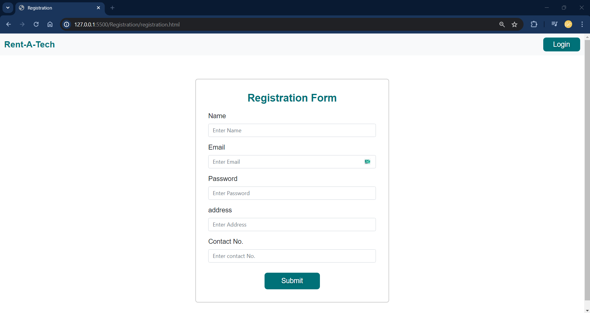
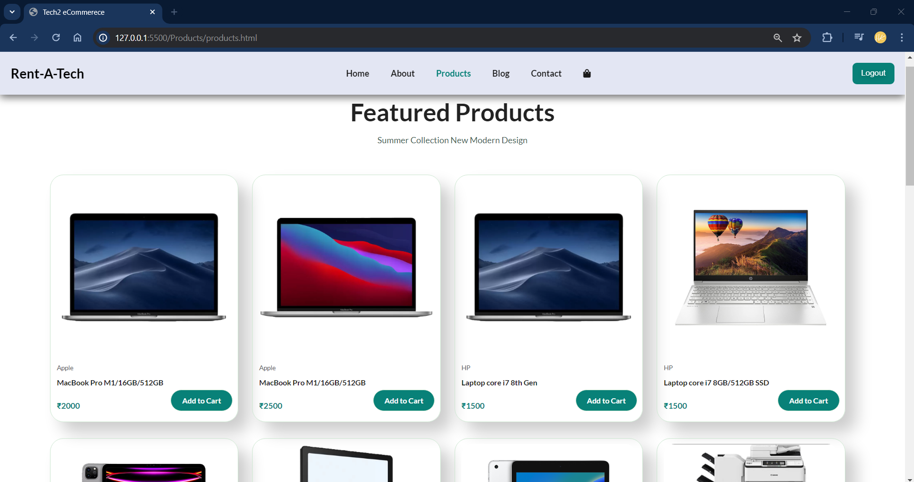
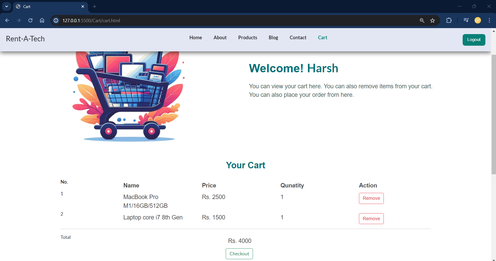
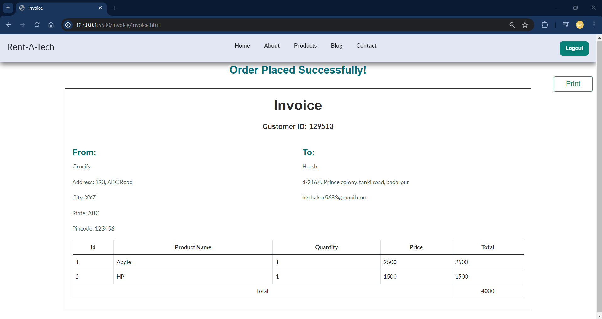
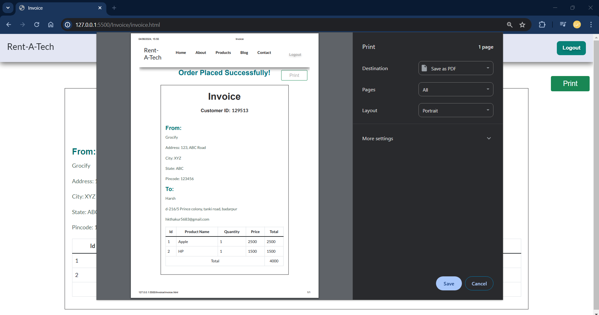

<!DOCTYPE html>
<html lang="en">
<head>
  <meta charset="UTF-8">
  <meta name="viewport" content="width=device-width, initial-scale=1.0">
  <title>Rent-Tech Products - README</title>
  
</head>
<body>
  <h2>Screenshots</h2>

  

    
    
  

  

    
    
  

  

    
    
  

  

    
    
  

  

    
    
  

  

    
    
  

 

    
    
  

  </body>
</html>
